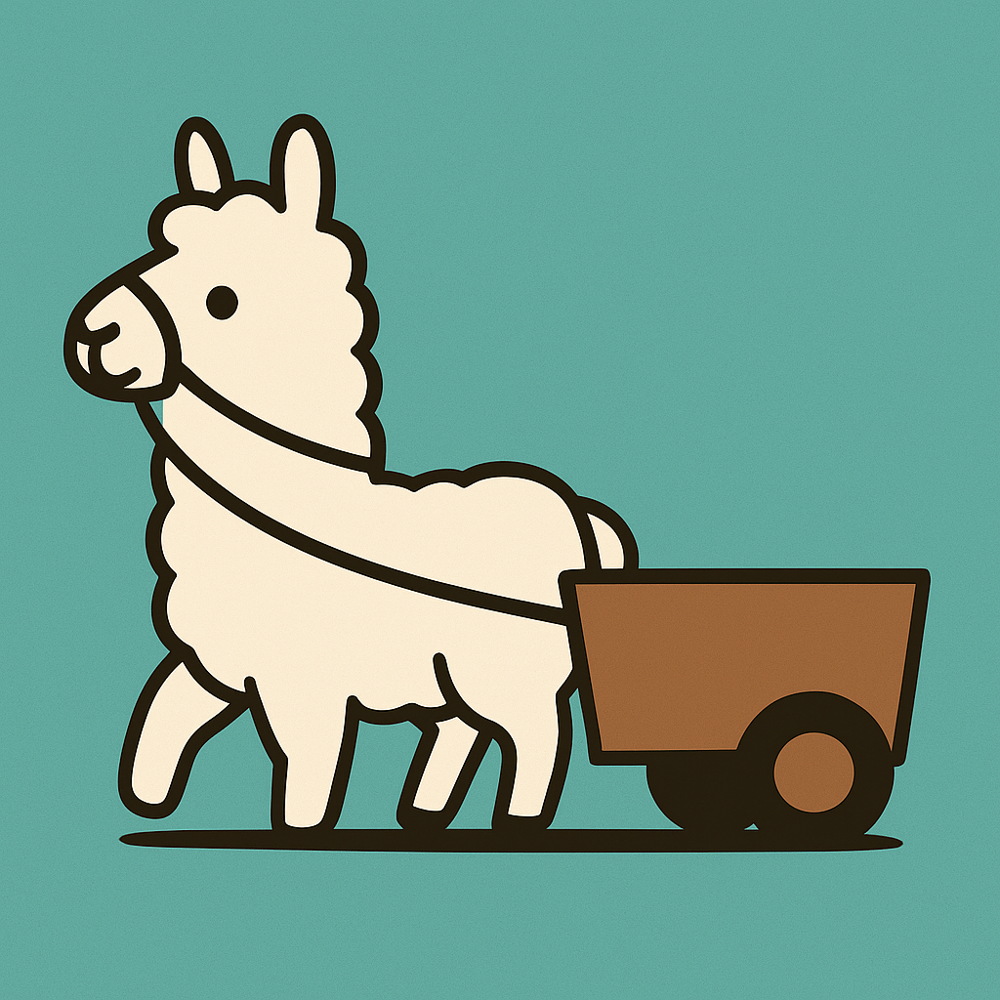
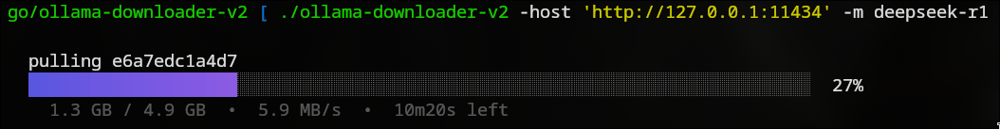

[](https://github.com/reinhardt-bit/ollama-downloader-v2/actions/workflows/go.yml) 

# Ollama Downloader v2

<p align="center">
  
</p>

A standalone, command-line tool for downloading Ollama models with an interactive progress bar and robust error handling, including resumable downloads and user-controlled retry options.


## Features

*   **Direct Ollama API Interaction:** Communicates directly with the Ollama `/api/pull` endpoint for full control over the download process.
*   **Interactive Progress Bar:** Provides a visually appealing, real-time progress bar showing download percentage, size, speed, and ETA using Bubble Tea.
*   **Graceful Error Handling:** Handles network errors, API errors, and invalid model names gracefully, providing clear feedback.
*   **Timeout and Resumption:** If a download times out or a context deadline is exceeded, the user is presented with options to:
    *   **Continue (until next error):** Resume the download and prompt again on subsequent timeouts.
    *   **Continue (until download completed):** Automatically resume without further prompts until the download is complete.
    *   **Quit:** Terminate the program.
*   **Resumable Downloads:** Leverages Ollama's built-in resume functionality to continue interrupted downloads.
*   **Graceful Cancellation:** Users can cancel the download at any point using `q` or `Ctrl+C`.

<p align="center">
  
</p>

## Installation

To install `ollama-downloader-v2`, you need to have Go (version 1.24 or higher recommended) installed on your system.

1.  **Clone the repository:**
    ```bash
    git clone https://github.com/reinhardt-bit/ollama-downloader-v2.git
    cd ollama-downloader-v2
    ```

2.  **Build the executable:**
    ```bash
    go build -o ollama-downloader-v2
    ```

This will create an executable named `ollama-downloader-v2` in your current directory.

## Usage

Run the `ollama-downloader-v2` executable from your terminal.

```bash
./ollama-downloader-v2 --model <model-name> [flags]
```

### Flags:

*   `--model, -m` (Required): The name of the Ollama model to download (e.g., "llama3", "gemma:2b").
*   `--host` (Optional): The Ollama API host and port (e.g., "http://localhost:11434"). Defaults to the value of the `OLLAMA_HOST` environment variable or `http://localhost:11434` if not set.
*   `--help, -h`: Displays the help message.

### Examples:

1.  **Download a model with default host:**
    ```bash
    ./ollama-downloader-v2 -m llama3
    ```

2.  **Download a model specifying a custom host:**
    ```bash
    ./ollama-downloader-v2 -m gemma:2b --host http://192.168.1.100:11434
    ```

3.  **Display help message:**
    ```bash
    ./ollama-downloader-v2 --help
    ```

## Technical Stack

*   **Language:** Go
*   **Libraries:**
    *   `net/http`: For making API requests.
    *   `context`: For managing request cancellation and timeouts.
    *   `encoding/json`: For parsing JSON responses from the Ollama API.
    *   `github.com/charmbracelet/bubbletea`: For building the interactive command-line user interface.
    *   `github.com/charmbracelet/bubbles/progress`: For the interactive progress bar component.
    *   `github.com/charmbracelet/lipgloss`: For styling the terminal output.

## Contributing

Contributions are welcome! If you find a bug or have a feature request, please open an issue. If you'd like to contribute code, please fork the repository and submit a pull request.

## License

This project is licensed under the GPL-3.0 License - see the LICENSE file for details.
